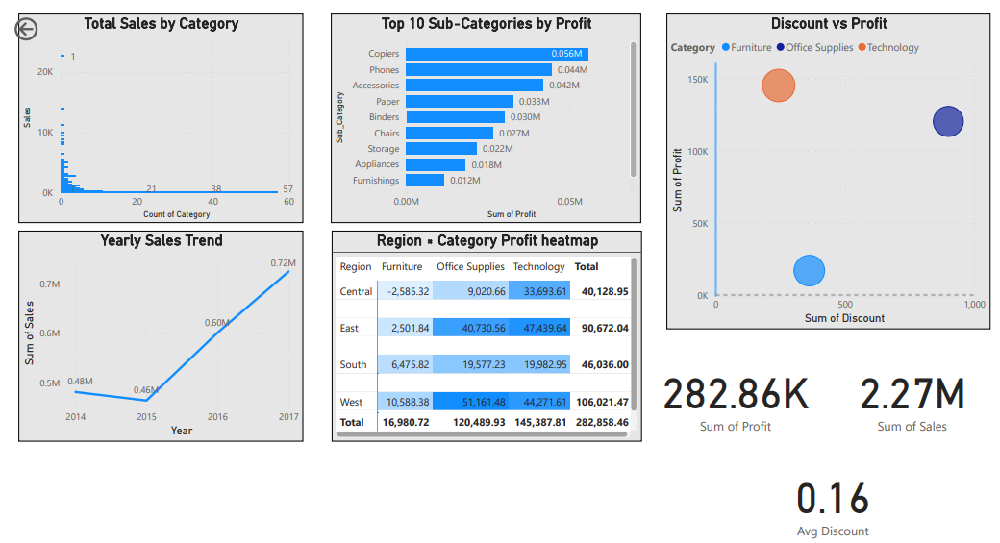
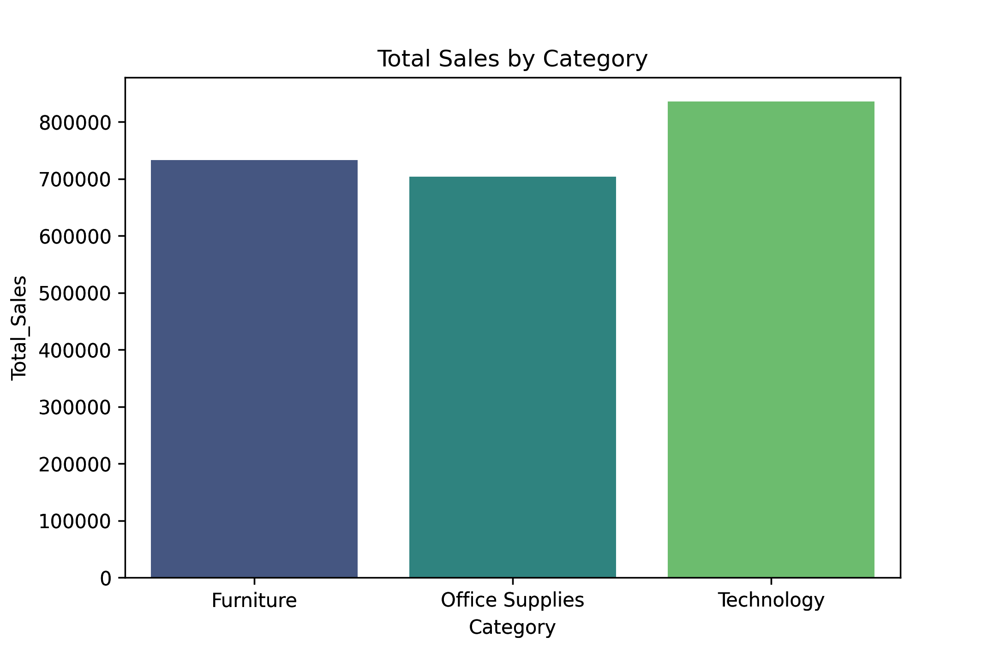

# 🛒 E-Commerce Sales Analytics Project

📊 An end-to-end **E-Commerce Sales Analytics** project that transforms raw data into actionable business insights using **Python, MySQL, Streamlit, and Power BI**.

This project demonstrates the complete data pipeline — from **data cleaning and analysis** to **interactive dashboards and reporting**.
---

## 📸 Project Preview

### 📊 Power BI Dashboard



### 📈 Python Visualization



---

## 🚀 Features

### 🔹 Data Processing

* Cleaned and preprocessed **10,000+ records** using Pandas
* Handled missing values, duplicates, and date formatting
* Created new features like **Profit Margin & Time-based metrics**

### 🔹 Exploratory Data Analysis (EDA)

* Sales distribution by category and region
* Monthly and yearly sales trends
* Top-performing customers and products
* Loss-making product identification

### 🔹 Interactive Dashboards

* 📊 **Streamlit Dashboard**

  * Dynamic filters (Category, Region, Year)
  * Real-time SQL queries
  * Multiple visualizations (bar charts, heatmaps, scatter plots)

* 📈 **Power BI Dashboard**

  * KPI cards (Sales, Profit, Orders)
  * Drill-down analysis
  * Interactive slicers (Region, Segment, Year)

---

## 🧰 Tech Stack

* **Python** → Pandas, NumPy, Matplotlib, Seaborn
* **Database** → MySQL
* **Visualization** → Power BI, Streamlit
* **Tools** → Git, GitHub

---

## 📂 Project Structure

```
ecommerce-sales-analytics/
│
├── data/              # Raw and cleaned datasets
├── notebooks/           # Python scripts (cleaning + EDA)
├── visualization_dashboard.py     #Streamlit Dashboard         
├── visuals/           # Power BI dashboards & images
├── ecommerce_db.sql   # Database
├── powerbi.pbix      #Powerbi Dashboard
├── README.md
```

---

## ▶️ How to Run

1. Clone the repository:

   ```
   git clone https://github.com/MuhammadShayan8401/ecommerce-sales-analytics.git
   ```

2. Navigate into the project:

   ```
   cd ecommerce-sales-analytics
   ```

3. Install dependencies:

   ```
   pip install -r requirements.txt
   ```

4. Run Python analysis:

   ```
   python scripts/phase4_visuals.py
   ```

5. Launch Streamlit dashboard:

   ```
   streamlit run visualization_dashboard.py
   ```

6. Open Power BI dashboard:

   * Go to `visuals/`
   * Open `.pbix` file in Power BI Desktop

---

## 📈 Key Business Insights

* 📊 **Technology category** generated the highest sales
* 💸 High **discounts negatively impact profit**
* 🌍 Some regions show **high sales but low profitability**
* 👥 A small percentage of customers contribute significantly to revenue

---

## 📌 Notes

* Dataset used: **Superstore Dataset (~10,000 records)**
* Update database credentials before running MySQL integration
* Ensure Power BI Desktop is installed to view `.pbix` files

---

## 🚀 Future Improvements

* 🔮 Add **Machine Learning models** for sales prediction
* 🌐 Deploy dashboard using **Streamlit Cloud**
* 🔄 Integrate **real-time data pipeline**
* 📊 Enhance UI with advanced dashboard design

---

## 👨‍💻 Author

**Muhammad Shayan Ahmed**

🔗 LinkedIn: https://www.linkedin.com/in/muhammad-shayan-ahmed-05b847281/
💻 GitHub: https://github.com/MuhammadShayan8401

---

⭐ If you found this project useful, consider giving it a star on GitHub!
